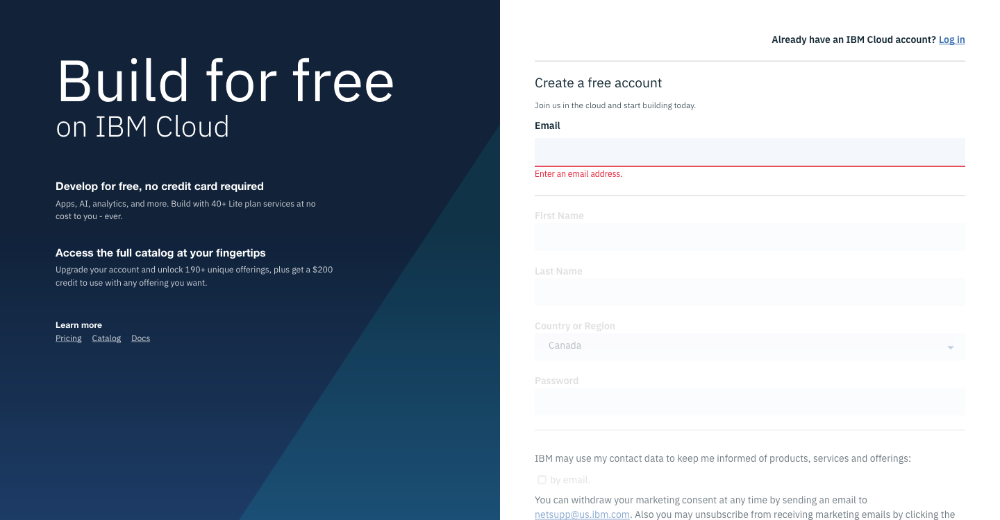
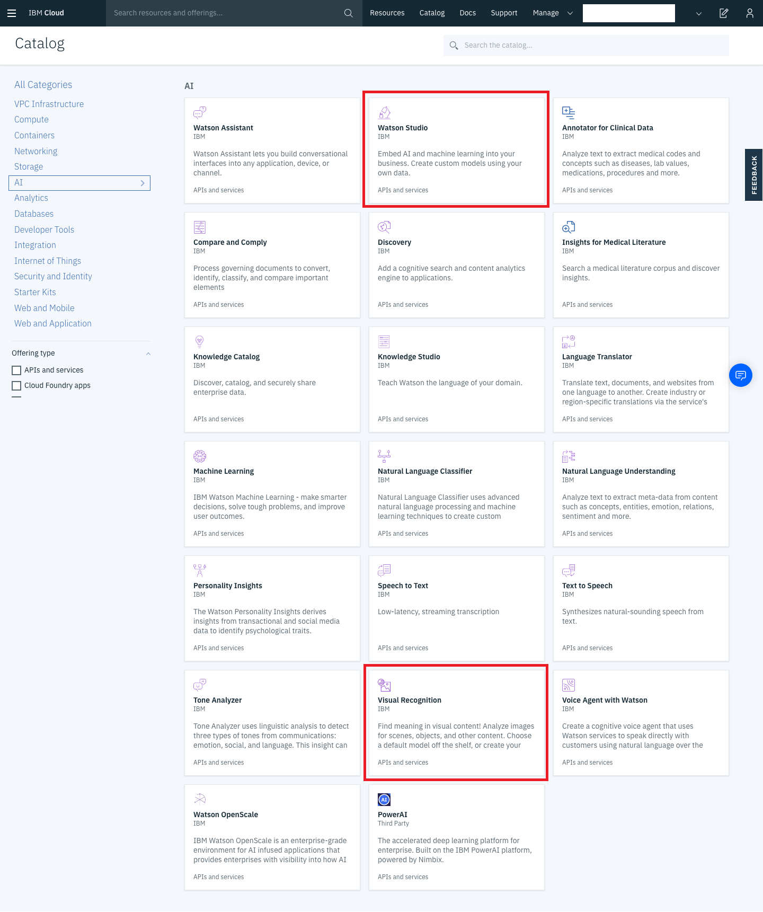
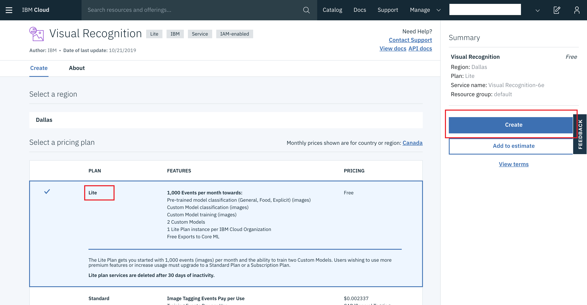
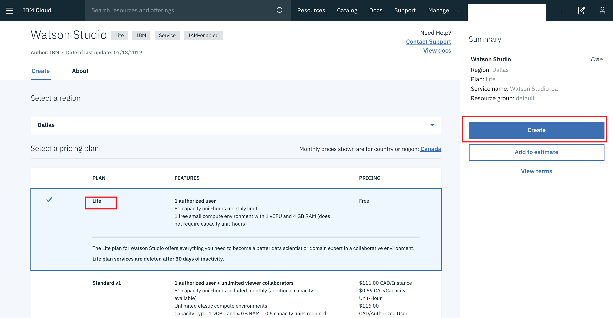
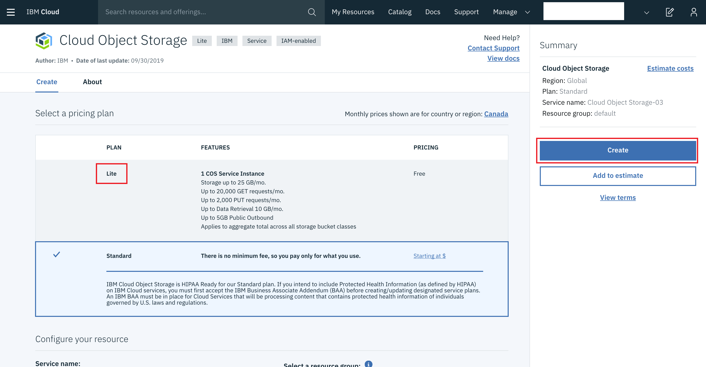
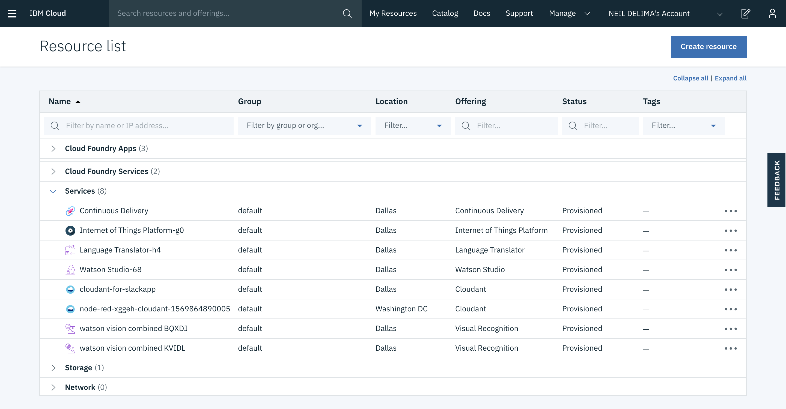
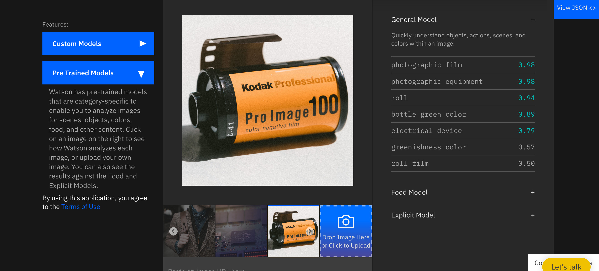

# Pre-requisites  

In order to complete this hands-on workshop, you will need to:

* Sign up for a free IBM Cloud Lite Account
* Provision an instance of a Watson Visual Recognition IBM Cloud service
* Provision an instance of a Watson Studio IBM Cloud service
* Provision an instance of the IBM Cloud Object Storage service 

## Sign up for a free IBM Cloud Lite Account  
To sign up for a free IBM Cloud Lite Account, navigate to the [IBM Cloud registration page](https://cloud.ibm.com/registration) 

## Login to your account and view the Catalog  
1. Login to an existing account at: https://cloud.ibm.com/login

2. Once logged into IBM cloud Navigate to the [IBM Cloud Catalog](https://cloud.ibm.com/catalog) by selecting the Catalog menu option at the top of the screen. From the categories menu at the right in the Catalog view, select AI to view a list of AI services. From the catalog you can select a service such as Watson Studio or Object and provision an instance at a certain service level depending on your needs. For this workshop we will be using the free tier of all services needed.
  

## Provision an instance of a Watson Visual Recognition IBM Cloud service  
To provision an instance of the Watson Visual Recognition service, search for and select the service from the IBM Cloud Catalog or navigate to the Watson Visual Recognition service page at: https://cloud.ibm.com/catalog/services/visual-recognition

To create a new Visual Recognition service instance:

* Choose the Lite (free) pricing plan 
* Use default setting (you may choose to update the service name)  
* click 'Create' 

  

Navigate to: https://cloud.ibm.com/resources

You should now see your new Visual Recognition under services 

## Provision an instance of a Watson Studio IBM Cloud service  
To provision an instance of the Watson Studio service, search for and select the service from the IBM Cloud Catalog or navigate to the Watson Visual Recognition service page at: https://cloud.ibm.com/catalog/services/watson-studio

To create a new Watson Studio service instance:

* Choose the Lite (free) pricing plan 
* Use default setting (you may choose to update the service name)  
* click 'Create' 

  

Navigate to: https://cloud.ibm.com/resources

You should now see your new Watson Studio under services 

## Provision an instance of the IBM Cloud Object Storage service
To provision an instance of Cloud Object Storage service, search for and select the service from the IBM Cloud Catalog (in the Storage category) or navigate to the Cloud Object Storage service page at: https://cloud.ibm.com/catalog/services/cloud-object-storage

To create a new Watson Studio service instance:  

* Choose the Lite (free) pricing plan 
* Use default setting (you may choose to update the service name)  
* click 'Create' 

  

Navigate to: https://cloud.ibm.com/resources

You should now see your new Watson Studio under Storage

## Preview your newly created services
To view your newly created services, navigate to the Resources menu option from the hamburger menu on the left in the IBM Cloud web console. Expand the Services section and you should see the 2 new services (or more if you already have an IBM Cloud account and have created services before) that you just created. Under the Storage section you should see you instance of Cloud Object Storage. You can launch each of these services and navigate through the web console user interface to get familiar with them.

  

## Try a Prebuilt Visual Recognition Model
Now that you have setup the IBM Cloud services needed for this workshop, its time to get started with a simple demo of visual recognition. Navigate to the Watson Visual Recognition demo site: https://www.ibm.com/watson/services/visual-recognition/demo

Under the ***Pre Trained Models*** section, click on an image to the right. Watson Visual recognition will use one of its pre-trained models that are category-specific to enable you to analyze images for scenes, objects, colors, food, and other content and generate a set of categories identified in the image along with the probability of prediction. Drag and drop the baby-bear.jpg file (or any image of your choice) and observe the prediction.  

In addition to the pre-trained models, Watson Visual Recognition allows you to create custom models. You can also use Watson Studio to build more powerful custom models using various open source tools like Jupyter Notebooks and R-Studio and deep learning libraries such as Tensor Flow using its web user interface.

