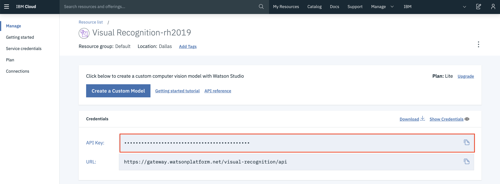

# Visual recognition using pre trained and custom models with Watson Visual Recognition

## Try a Prebuilt Visual Recognition Model

Visit Watson Studio Site at: https://dataplatform.cloud.ibm.com/

- Under 'Services' click on your Visual Recognition Service Instance 

- Click 'Test' on one of the three prebuilt models (General, Food or Explicit) 

- Click on the'Test' tab 

## Built A Custom Classifier 
 1. Navigate to https://cloud.ibm.com/resources
 2. Select your Visual Recognition Instance 
 3. Click 'Create A Custom Model'
  
 4. Click 'Create Model' Under Custom Models
  
 
 5.Drag the zip files named Dogs and Cats from the Images folder to the 'Upload Directly' section
   
     - The classes should be automatically added to the model
     - If the classes are not added check the zip files and click 'Add to model
  
 6. Click 'Train Model'
   (will take ~5-10 minutes to train)
7. Once training is complete Click on Your classifier name in the breadcrumbs beside 'Edit and retrain'
  
 8. Click on the 'Test' tab 
   
  9. Test the classifier using the test dog and cat images located in the images folder or use your own 
  

Visit the Visual Recognition docs for more information and code snippets from multiple different coding languagues.
https://cloud.ibm.com/apidocs/visual-recognition/visual-recognition-v3#introduction

## Using a Model

#### Using cURL command in terminal

- Under the 'Implementations' tab code snippets are available to be used in your code to classify an image 
- Try using terminal: 
1) Open up the terminal 
2) Copy the code snippet listed as 'Classify an image (GET)' under cURL and paste it into a new terminal window
 
3) Get the API key:
 - Navigate to https://cloud.ibm.com/resources
 - select your Visual Recognition Instance 
 - Copy the API key
  
 4) In the code snippet replace '{apikey}' with the copied key
 5) Click Enter, you should receive the below JSON
 
 {
 
    "images": [
        {
            "classifiers": [
                {
                    "classifier_id": "default",
                    "name": "default",
                    "classes": [
                        {
                            "class": "banana",
                            "score": 0.562,
                            "type_hierarchy": "/fruit/banana"
                        },
                        {
                            "class": "fruit",
                            "score": 0.788
                        },
                        {
                            "class": "diet (food)",
                            "score": 0.528,
                            "type_hierarchy": "/food/diet (food)"
                        },
                        {
                            "class": "food",
                            "score": 0.528
                        },
                        {
                            "class": "honeydew",
                            "score": 0.5,
                            "type_hierarchy": "/fruit/melon/honeydew"
                        },
                        {
                            "class": "melon",
                            "score": 0.501
                        },
                        {
                            "class": "olive color",
                            "score": 0.973
                        },
                        {
                            "class": "lemon yellow color",
                            "score": 0.789
                        }
                    ]
                }
            ],
            "source_url": "https://watson-developer-cloud.github.io/doc-tutorial-downloads/visual-recognition/fruitbowl.jpg",
            "resolved_url": "https://watson-developer-cloud.github.io/doc-tutorial-downloads/visual-recognition/fruitbowl.jpg"
        }
    ],
    "images_processed": 1,
    "custom_classes": 0
}

#### Using Jupyter notebook

See [Test Custom Classifier Notebook](./TestCustomClassifier.ipynb)

