## Overview
In this demo/lab you will learn how to detect objects in images using PowerAI Vision. You can register for [30-day access on IBM Cloud](https://developer.ibm.com/linuxonpower/deep-learning-powerai/vision/access-registration-form/), or [download 90-day trial version](https://epwt-www.mybluemix.net/software/support/trial/cst/programwebsite.wss?siteId=584&tabId=1162&w=1&cm_sp=dw-bluemix-_-linuxonpower-_-devcenter&_ga=2.78880276.1655364567.1571253680-1292271951.1548435005) to be able to go through the steps in this lab. PowerAI Vision user interface will be used for most of the lab.

In this lab, the objective is to detect and locate Coca-Cola bottles as objects in images. After successful login, the main steps include:
  Create a data set and upload the images
  Label the objects in each image
  Build a model to detect objects in images
  Deploy and evaluate the model
  Identify and locate objects in an image

## Navigate through PowerAI Vision user interface
There are four tabs: Data sets, Models, Custom models and Deployed models.

## Create a data set and upload the images
1. Navigate to Data sets tab, click the "+" below "Create new data set", provide a name for the new data set, then click "Create" button.
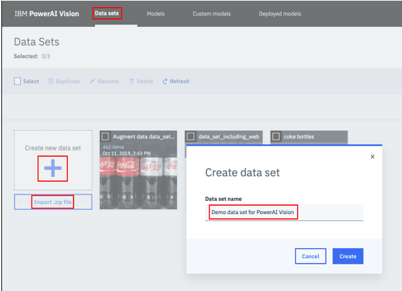
2. Open the newly created data set, drag the image files from your local and drop them to the data set, click "Add files" button to upload the image files to the data set.
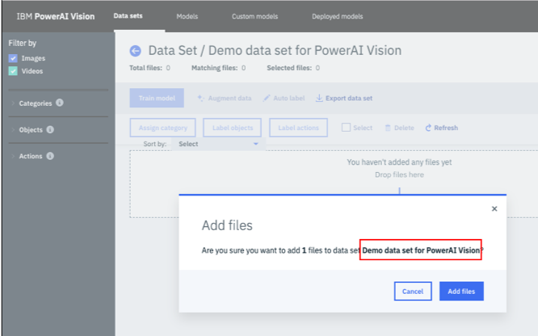

## Label the objects in each image
1. Navigate to the left navigation bar, click "Add object" link to open a dialog window. Provide a new object name, then click "Add" button. Repeat adding new object names until all the object names are added, then click "OK" button.
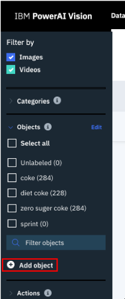 
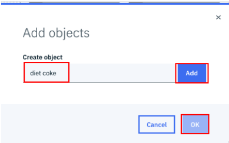
2. Navigate to the newly created data set, click the first image, click "Label objects" button to open Label objects Panel. Click one object from the right bar, and select "Box" from the bottom, then create a bounding box around the object with the correct label. Repeat the steps for each individual object in every image.
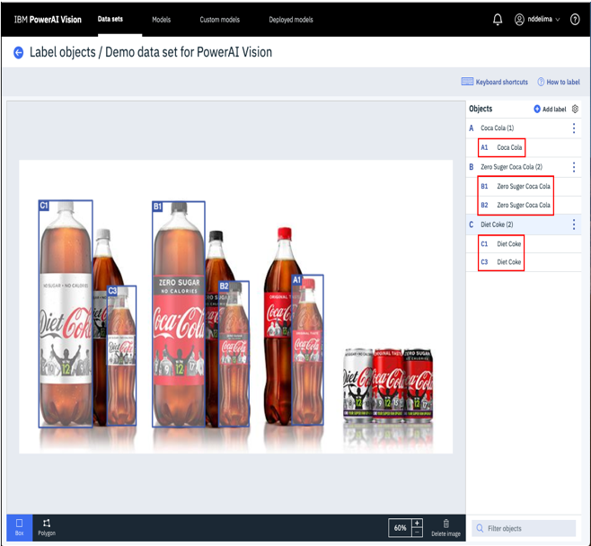
3. Repeat the above step for all the images in the data set.
4. Click the "Select" checkbox, then click Augment data link, click all the checkboxes then click "Continue" button. In the dialog provide a new name for the new data set. Click "Create data set" button.
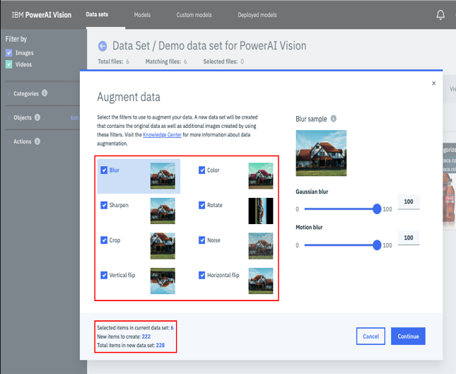 
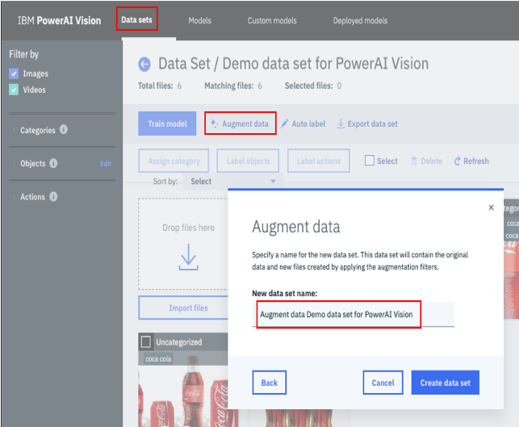

## Build a model to detect objects in images
1. In the newly created data set, click "Train model" button. Select "Object Detection" as Type of Training, take the default for the rest, click "Train" button.
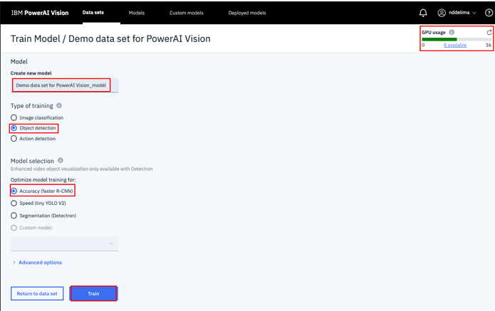
2. Monitor the training process, which takes some time. 
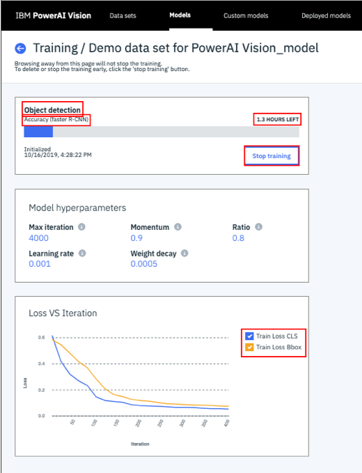
3. When the training process is complete, check the loss and accuracy.
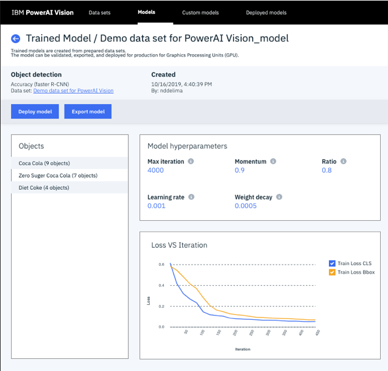

## Deploy and evaluate the model
1. Under Models tab, find and click the newly created model, click "Deploy model" button, provide a name for the deployed model, then click "Deploy" button.
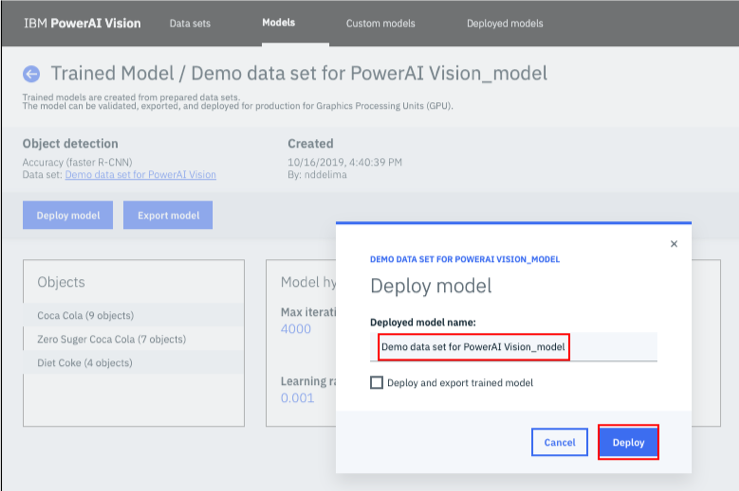
2. Under Deployed Model tab, find and click the newly deployed model, check the model details.
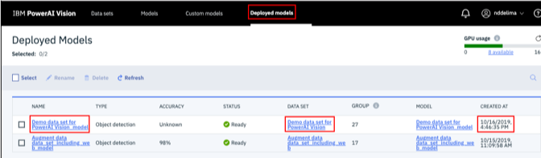 
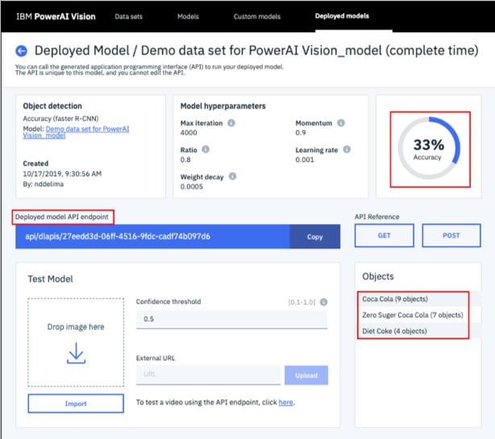
3. Drag an coke image from local and drop to Test Model box. Check the result on the right side of the image.
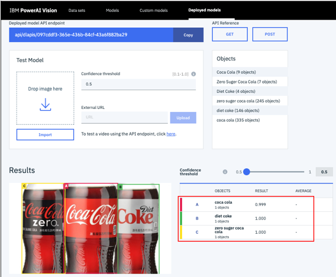

## Identify and locate objects in an image
1. Under Deployed Model tab, find and click the newly deployed model, find the Deployed model API endpoint, click "Copy" button.
2. Find the hostname of the PowerAI Vision UI, add "https://" before it, and paste the API endpoint string at the end to form the full REST request.

3. Open Postman as REST client, Select "GET" as the request method, paste the REST request, and set one Query Params: imageUrl as the KEY, the location of the test image as the VALUE. Click "Send" button. Check the response.
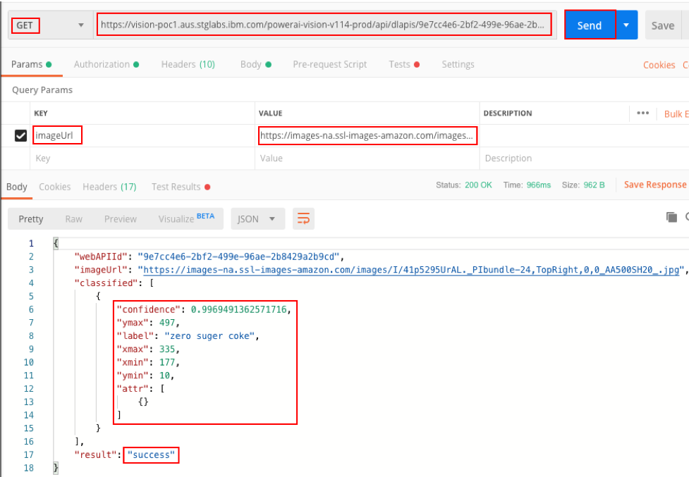

### Summary  
This concludes the demo/lab where you learned how to build a vision recognition model to detect objects in PowerAI Vision, then use the model via the REST API.
