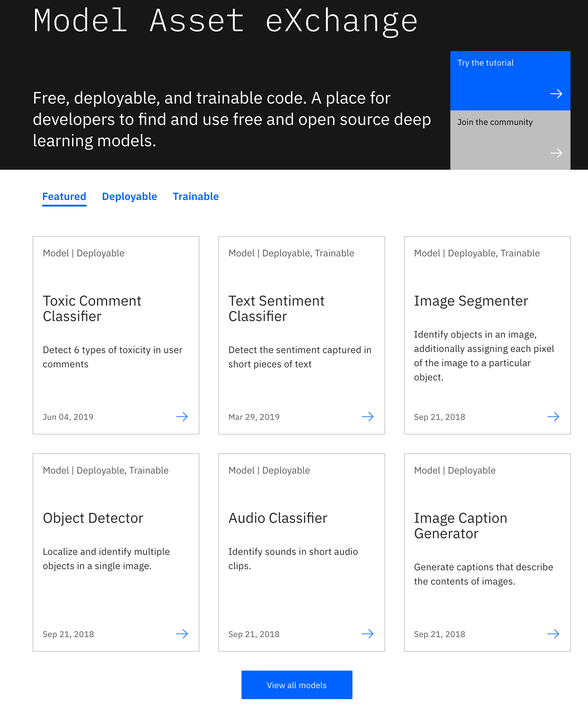
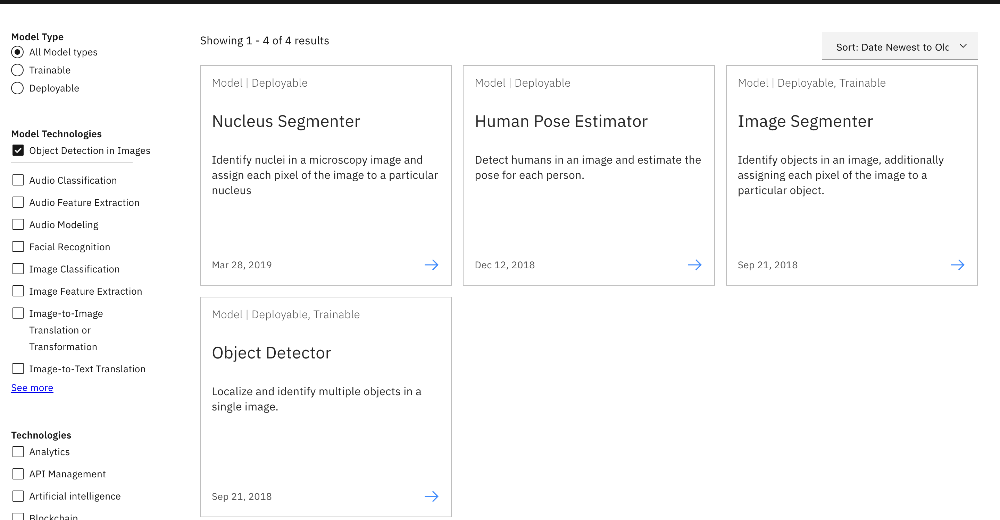
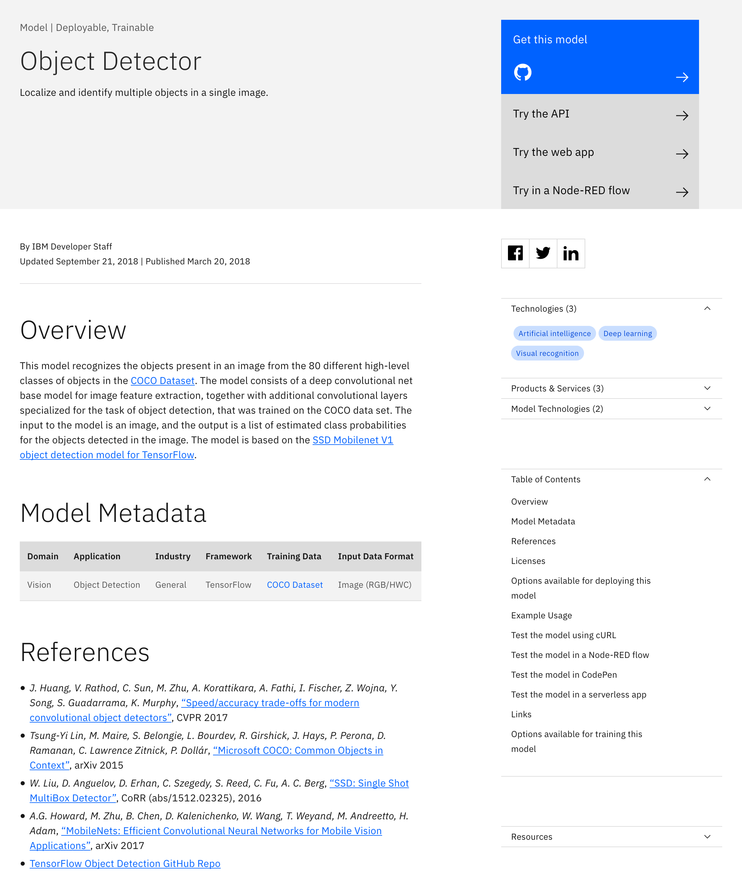
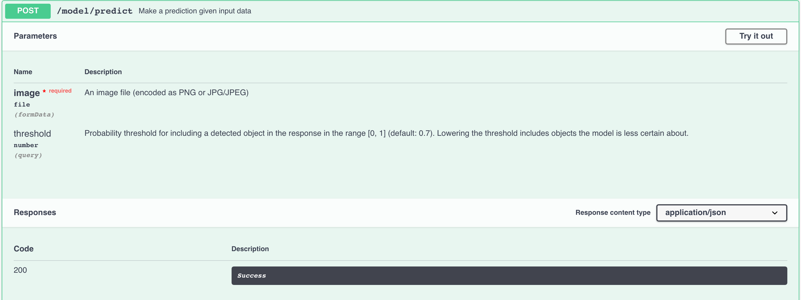
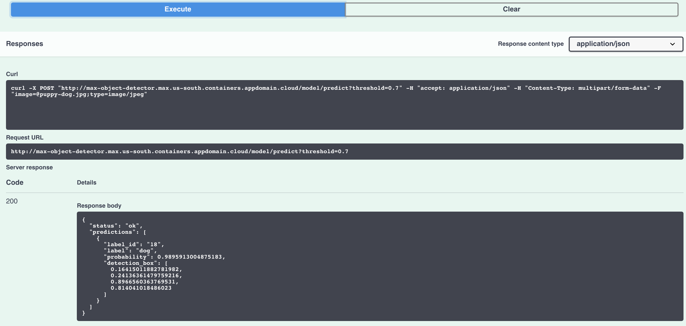
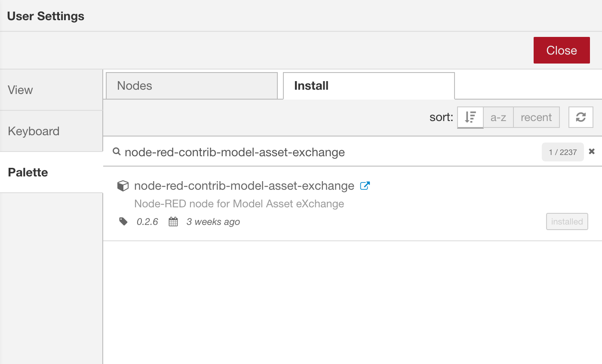
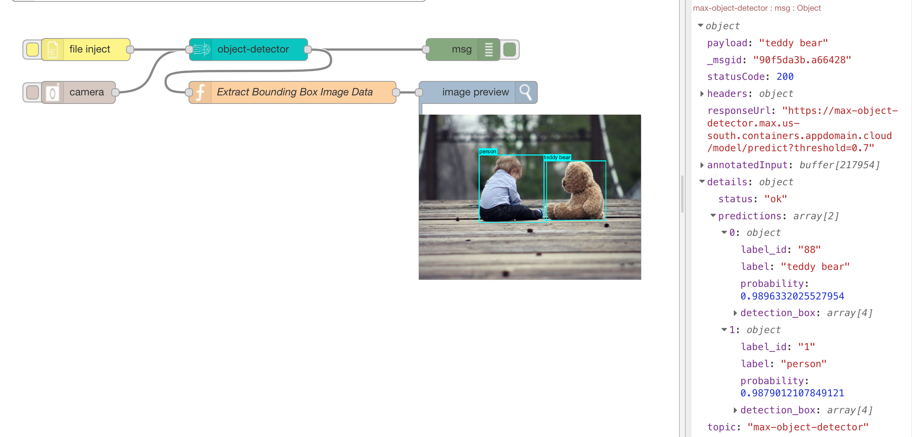

## Overview
In this hands-on demo/lab you will learn how to classify an image and detect objects in an image using a pre-trained, deployable deep learning object detection model available in the [Model Asset Exchange (MAX)](https://developer.ibm.com/exchanges/models/). MAX is a free open source searchable repository of deployable deep learning models available on [IBM Developer](https://developer.ibm.com/). The repository contains both deployable models as well as trainable models. Trainable models can be customized and trained using your own data. Both deployable and trainable models are available as Docker images that can then be deployed to a local Docker installation, the IBM Cloud Kubernetes service, OpenShift or any other container service. These models can also be tested directly via the REST API swagger available on MAX. The MAX team has also created custom Node-Red nodes that allow you to import and use a model directly in a Node-Red flow which can be useful in many scenarios such as image classification from data fed via an IoT device. Sample app are also often provided that can be used to explore and test the model.

The hands-on demo uses the Object Detector model available on MAX. 
## Navigate through the MAX repository and Find the Object Detector Model
To find the model on MAX
1. Navigate to he [Model Asset Exchange (MAX)](https://developer.ibm.com/exchanges/models/) and click on the "View All Models" button

2. From the "Model Technologies" options select "Object Detection in Images" and from the "Model Type" radio button select "Deployable" and Click on the [Object Detector model](https://developer.ibm.com/exchanges/models/all/max-object-detector/)

3. This launches the Object Detector model page which lists information about the model, data sets used to train the model and reference papers and algorithms, license details as well as examples on how to use the model and links to the GitHub repository to download the model, REST API Swagger to test the model, a sample web app and other options. As seen in the Object Detector model documentation page, this model detects objects in images from 80 classes of objects in the [COCO Dataset](http://mscoco.org/). The input to the model is the image the needs to be classified and the output is the probabilities of the list of classes of objects in the image. 

4. Visit the GitHub repository of the MAX Object Detector model: https://github.com/IBM/MAX-Object-Detector


## Test the Object Detector model via the Swagger API from the Model Asset Exchange
1. Click the Try the API button at the top of the screen.
2. You can try the GET labels and metadata APIs which return a list of 90 supported labels and meta-data associated with the model. Now lets try classifying an image using the POST /model/predict API.
3. Click the "Try it Out" button from the POST /model/predict API and for the image parameter, use any image from the lab ./images/test/puppy-dog.jpg directory and upload it. Once the image has been uploaded, click the (blue) Execute button.

4. The API executes and calls the model to classify the image, returning a JSON result with the prediction as in the image below. Note the label in the returned image and the probably of that label. In this case "label": "dog" and "probability": 0.9895913004875183.


## Test the Object Detector model by deploying the Docker image to a Kubernetes cluster.
This assumes you have provisioned a cluster and setup your environment, provisioned your Kubernetes Cluster and setup your IBM Cloud and Kubernetes command line plugins.
1. Clone the MAX-Model repository from GitHub. This repository contains a Docker file with an image containing the trained model that can be deployed to a container as well as all the supporting information such as licenses, scripts and sample images.  
```git clone https://github.com/IBM/MAX-Object-Detector.git```
2. Find the .yaml file in the downloaded directory.
 ```cd MAX-Object-Detector  ```
``` ls *.yaml ```
3. Apply the configuration file to your Kubernetes cluster and deploy the mode using.  
```ibmcloud login -a cloud.ibm.com -r us-south```  
```kubectl apply -f ./max-object-detector.yaml```
4. Once the container is running, find the IP address of your Kubernetes cluster and the exposed port of the node that runs the container.  
```ibmcloud cs workers <mycluster name>```  
```kubectl describe service max-object-detector | grep NodePort ```
5. Navigate to the http://PUBLIC_IP:PORT address in your browser. You should find the API front end as shown in the following image.
Test the API like you did in the previous step.
6. You can even try the model using the cURL command
Try out the model deployed to IBM Kubernetes Service and via CURL
```curl -F "image=@samples/dog-human.jpg" -XPOST http://127.0.0.1:5000/model/predict?threshold=0.5```
  

## Test the Object Detector model in a Node-Red flow.
This assumes you have an IBM Cloud account and provisioned an instance of the Node-Red starter service or deployed Node-Red as a Cloudfoundry or container app. 
1. Import the following modules in your Node-Red editor:  

* [node-red-contrib-model-asset-exchange](https://www.npmjs.com/package/node-red-contrib-model-asset-exchange)
* [node-red-contrib-browser-utils](https://www.npmjs.com/package/node-red-contrib-browser-utils)
* [node-red-contrib-image-output](https://npmjs.org/package/node-red-contrib-image-output)

by clicking on the ***Manage palette*** drop down menu option available on the top right of the Node-Red console. 

2. On the Palette tab of the User Settings screen that appears, search for the 3 modules listed above (one at a time) and install each of the three by clicking the install button besides the module.


3. Import the Node-Red Object Detector model flow, by coping the Node-Red flow available here: https://flows.nodered.org/flow/33d3214c1f5774009ffbc983c96f1594
and importing the flow by clicking on the ***Import->Clipboard*** drop down menu option available on the top right of the Node-Red console. 

4. Deploy the imported flow and click on the ***file inject*** node to upload and image for classification and object detection. The node-red flow invokes the pre-trained object detector MAX model and classifies the image and returns a result with the classified image. Examine the JSON object in the returned result containing the classification/object detection details.


## Training the model
This model can be further trained on IBM Cloud using Watson Machine Learning. For details see the instructions in GitHub
https://github.com/IBM/MAX-Object-Detector/tree/master/training


### Summary  
This concludes the demo/hands-on lab where you learned how to classify an image and detect objects using a deployable visual recognition model from the Model Asset Exchange. Then use/test the model via the provided Swagger REST API, a docker container running locally or in a container registry like the IBM Kubernetes Service and finally in a Node-Red flow.  
