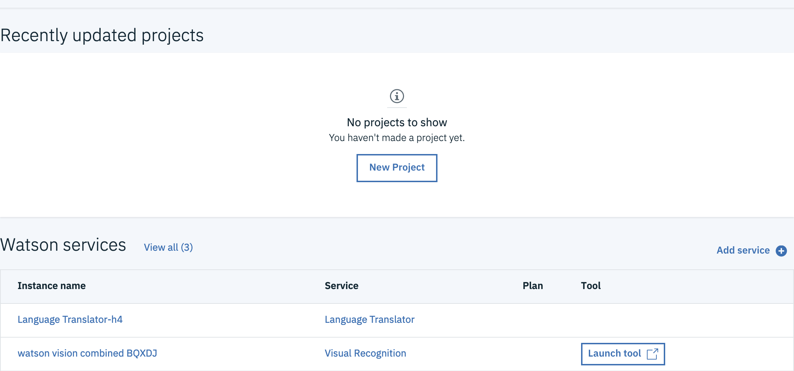
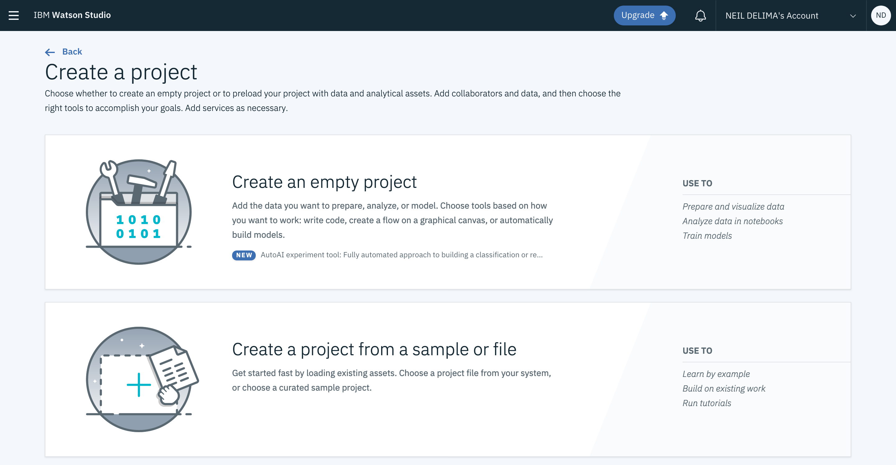
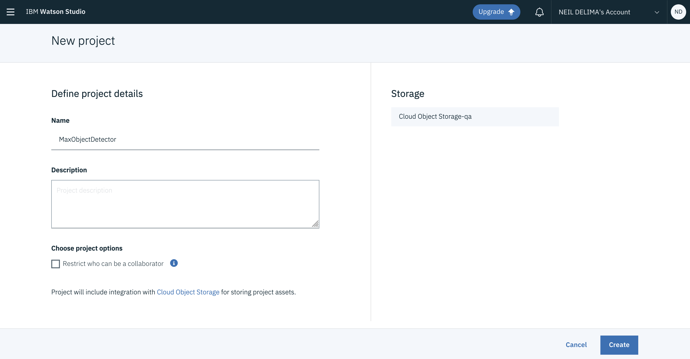
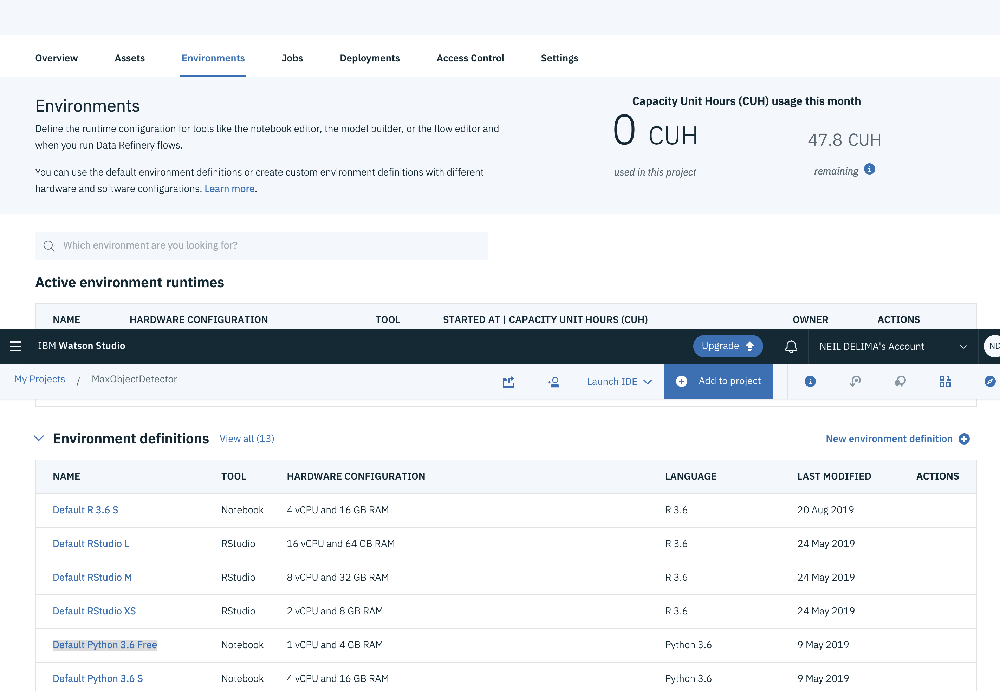
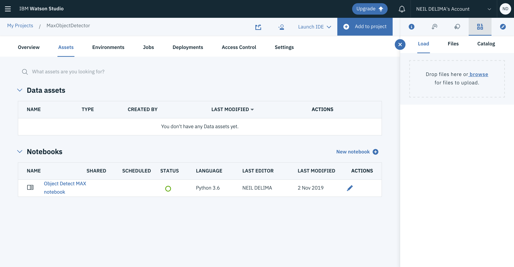
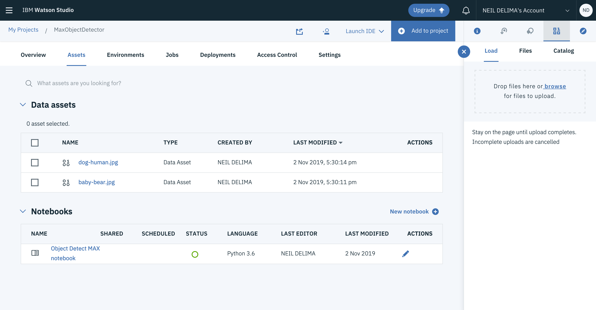
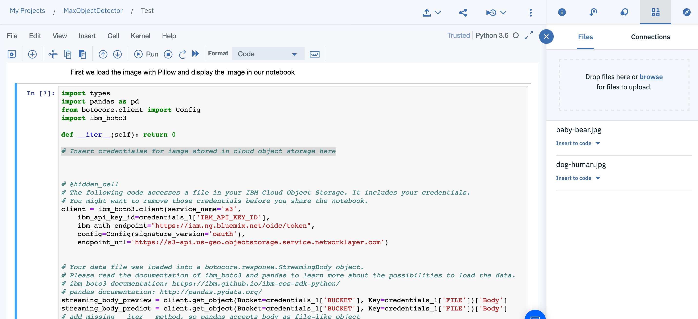

## Using your MAX Object Detector model in a Watson Studio Jupyter Notebook

In this section we are going to call our MAX object detector REST endpoint to classify an image and detect objects in it using a Jupyter notebook running in Watson studio. You will create a new Watson studio project, a new Python environment and a new python notebook using the [Object Detector Github notebook](https://github.com/IBM/MAX-Object-Detector/blob/master/demo.ipynb).

1. Launch Watson Studio by navigating to https://dataplatform.cloud.ibm.com/home?context=wdp and login using your IBMid.  
  

2. Click the ***New Project*** button to create a new Project and click ***Create and empty project***   

3. Give the project a name (note the Cloud Object storage identifier associate with your project) and click on the Create button at the bottom of the screen.  

4. Navigate to the Environments tab of your new project and from the ***Environment definitions*** section select the option ***Default Python 3.6 Free***  

5. For the new ***Default Python 3.6 Free*** click ***New Notebook***  

6. In the New notebook view, navigate to the ***From URL*** tab and fill in the details such as the name and the URL to the [Object Detector Github notebook](https://github.com/IBM/MAX-Object-Detector/blob/master/demo.ipynb) and click the ***Create Notebook*** button.  

7. A Jupyter notebook is created with the Object Detector python code that calls the object detector API using the demo instance and displays the object detection results.   

8. Navigate back to the ***Assets*** tab of your new Project. Here you will see your newly created Python notebook.  

9. We are now going to add an image that will be used for object detection using the code in the Python notebook. Drag an drop an image to the ***Drop files here or browse for files to upload.*** area on the ***Load*** tab which is at the left panel in the view on the ***Assets*** tab.  

10. Open your new notebook and click the edit icon to enter edit mode. Navigate to the code cell right after the title Step 1 to the section with a comment "# Insert credentialas for image stored in cloud object storage here". Navigate to the find and add data section. Select an image from the right and with the cursor placed at the comment section click ***Insert to Code -> Insert Credentials***  
  

11. Click on the ***Cells -> Run All*** menu option to run all code cells and observe the original image that gets dispalyed, the results from the Object Detector classification model and the image redrawn with object boudaries obtained from the results of the Object Detector model.
